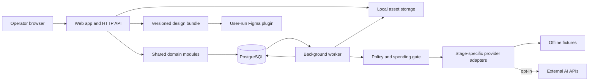

# Architecture v0.2

Status: revised design baseline under the owner-authorized review reconciliation of 6 September 2026. Documentation only; implementation and security verification remain pending. See [DECISIONS](DECISIONS.md) and [review resolution](REVIEW_RESOLUTION.md).

## Technology baseline

| Concern | Proposed choice | Reason |
|---|---|---|
| Language | TypeScript, strict mode | One language across interface, workers, contracts, and Figma plugin |
| Web application | Next.js App Router, React, Node runtime | Integrated application UI and HTTP boundary; container-hostable |
| Domain | Framework-independent TypeScript modules | Keep business rules reusable by web and worker |
| Validation | Zod, versioned JSON schemas | Validate external inputs and model outputs at runtime |
| Database | PostgreSQL, Drizzle with reviewed SQL migrations | Relational lineage, transactions, portable hosting |
| Jobs | pg-boss in a separate Node worker | Durable PostgreSQL-backed execution without Redis |
| Login | Better Auth backed by PostgreSQL | Local email/password sessions without a hosted identity dependency |
| Assets | Filesystem storage adapter locally; S3-compatible adapter later | Local operation with a clear migration path |
| UI | Tailwind CSS and accessible component primitives | Shared tokens and consistent interactions |
| Tests | Vitest; PostgreSQL integration tests; Playwright key flows | Validate business rules and real boundaries |
| Packaging | pnpm workspace; Docker Compose for local services | Reproducible dependency and service setup |

Use supported stable versions, resolve compatibility at foundation implementation, and commit exact versions and lockfile. Do not install preview releases merely to appear current. Framework/library capabilities are referenced in SOURCES; choices are engineering proposals.

## Execution topology



A modular monolith with two resident executable processes, plus a bounded maintenance command when retention is enabled; these are not independently owned microservices. Web accepts commands, authorizes them, commits run state, and returns a run ID. Worker does long-running generation/import work. Browser polls bounded status endpoints initially; streaming can follow. The HTTP request never waits for an entire creative workflow.

## Planned layout

```text
apps/web/                 UI, route handlers, session boundary
apps/worker/              durable job execution
apps/figma-plugin/        user-run assembly and result export
packages/domain/          client, brief, concept, review, experiment rules
packages/contracts/       versioned schemas and public types
packages/db/              schema, scoped repositories, migrations
packages/providers/       provider adapters and fixture implementations
packages/storage/         local and later S3 adapters
packages/ui/              agency UI tokens and components
fixtures/                 synthetic, clearly labelled examples
infra/                    local Compose; deployment files only when authorized
```

Routes do not call model SDKs directly. Providers never decide permissions or approval. UI never queries PostgreSQL. Worker uses the same domain and authorization policy as web. No global client state in singleton objects.

## Durable workflow

Stages: brief analysis → opportunities → concepts → human selection → copy/design specification → human production approval → Figma handoff → report import → computed metrics → interpretation → proposed next experiment.

Each stage has an independently versioned input/output schema and profile. Human approvals are explicit records referring to immutable revisions. Changing upstream inputs marks downstream artifacts stale and creates a new branch of lineage; it never silently overwrites published work.

Run states: queued, running, awaiting_review, needs_attention, succeeded, failed, cancelled. Attempts have separate identifiers, timeouts, lease/heartbeat, error category, and provider request ID. Cancellation is best effort for an already-billed external request and must say so.

Persist business run and an outbox event in the same database transaction. The worker-owned dispatcher submits outbox events to pg-boss with a stable deduplication key. Mark events delivered only after enqueue success. Workers use a unique effect key and conditional state updates; assume redelivery is possible. A queue cannot guarantee exactly-once external provider billing. On ambiguous provider timeout, reconcile via provider request ID if supported, otherwise mark outcome uncertain rather than blindly replaying paid work. Retry transient confirmed failures with bounded backoff and jitter; schema errors have limited repair attempts. Record retries and cost.

Reserve estimated spend atomically before dispatch, scoped to client and agency. Reconcile actual usage after completion. Recheck membership, cancellation, budget, and input revision before performing side effects. Do not retry authentication failures automatically. Provider fallback is explicit, allowed per client, and recorded.

## Local-first boundary

Default fixtures cover the full pipeline, including errors. No external fonts, analytics, identity service, model calls, or remote assets at runtime in strict offline mode. Connected-local mode still stores app data locally but explicitly sends selected context to approved providers. GitHub, coding assistants, and CodeRabbit are external development services; do not put client datasets in source control.

Future hosting runs the same containers, swaps the storage adapter, adds TLS, reliable backups, monitoring and email, and passes the readiness gates in PLAN. No cloud infrastructure is created during documentation/foundation work.

## Canonical subsystem specifications

- [DATABASE](DATABASE.md): schemas, role grants, scope bootstrap, reporting scale and migrations.
- [RUNTIME](RUNTIME.md): dispatcher, retries, reservations, timeouts and provider egress.
- [CUSTOMIZATION](CUSTOMIZATION.md): pipeline, industry, prompt and rubric revisions.
- [SECURITY](SECURITY.md): runtime threats, uploads, claims, privacy lifecycle and verification.
- [EVALS](EVALS.md): creative quality, regression tests and live model evaluation.

These specifications refine the overview above. They are design obligations at the milestones in PLAN, not completed controls.

## One application boundary

All client-data mutations enter `/api/v1` route handlers through `authorizeAndScope(session, client, capability)`, input validation, rate limiting and a scoped domain transaction. Server Actions for client mutations are prohibited in the baseline. Better Auth owns its separate `/api/auth` authentication endpoints; these do not perform client-domain writes. Owner bootstrap is an offline administrative command. Worker commands use the same domain capability evaluator with a verified job principal, not an HTTP session or an internal HTTP call.

Read-only server rendering uses the same scoped query service. Private responses use `Cache-Control: private, no-store`; no static generation, shared Next cache, service-worker caching or client-persistent data cache for authenticated content. Cache Components remain disabled in the initial configuration. Foundation must verify the chosen Next.js version's actual controls, including logout, user/client switching, back navigation and prefetched routes. Do not blindly copy obsolete route configuration flags.

## Dependency and process boundaries

`apps/web` imports contracts, domain, scoped database/storage services, auth and UI. It must not import live providers, worker startup, provider secrets or pg-boss. `apps/worker` owns dispatcher, executors, sweepers, egress and live credentials. Only provider transport modules may perform model-network I/O. Model SDKs are prohibited elsewhere by dependency checks. The egress broker is a module in this process, not a new service.

Add `packages/evals`, `packages/policy`, `packages/observability`, and `config/{pipelines,extensions,prompts,rubrics}` to the planned layout. Policy is pure capability/classification evaluation; it does not load provider keys. Shared domain packages never import applications, UI, framework internals or provider SDKs. Auth credentials are available only to web/auth; provider keys only to worker; neither process receives migration/retention credentials during ordinary operation.

Web writes a run plus a content-free dispatch record atomically. Only the worker drains those records into pg-boss. Queue and dispatch metadata are separate from client-data RLS; queue possession is not authorization. DATABASE specifies how the worker obtains trusted scope without granting unrestricted client reads.

## Product scope refinement

Internal provider-cost accounting is mandatory. Client invoicing, chargeback and payment collection are excluded. Two live text providers prove interoperability for the pilot; additional adapters including xAI remain supported follow-on tasks. Coding with Claude/Grok does not require enabling either as a runtime provider. Image generation remains an optional later stage; rights-cleared supplied images and editable Figma assembly suffice for the first pilot.
