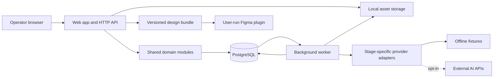

# Architecture v0.1

Status: proposed implementation baseline, documentation only. See DECISIONS for rationale and changes.

## Technology baseline

| Concern | Proposed choice | Reason |
|---|---|---|
| Language | TypeScript, strict mode | One language across interface, workers, contracts, and Figma plugin |
| Web application | Next.js App Router, React, Node runtime | Integrated application UI and HTTP boundary; container-hostable |
| Domain | Framework-independent TypeScript modules | Keep business rules reusable by web and worker |
| Validation | Zod, versioned JSON schemas | Validate external inputs and model outputs at runtime |
| Database | PostgreSQL, Drizzle with reviewed SQL migrations | Relational lineage, transactions, portable hosting |
| Jobs | pg-boss in a separate Node worker | Durable PostgreSQL-backed execution without Redis |
| Login | Better Auth backed by PostgreSQL | Local email/password sessions without a hosted identity dependency |
| Assets | Filesystem storage adapter locally; S3-compatible adapter later | Local operation with a clear migration path |
| UI | Tailwind CSS and accessible component primitives | Shared tokens and consistent interactions |
| Tests | Vitest; PostgreSQL integration tests; Playwright key flows | Validate business rules and real boundaries |
| Packaging | pnpm workspace; Docker Compose for local services | Reproducible dependency and service setup |

Use supported stable versions, resolve compatibility at foundation implementation, and commit exact versions and lockfile. Do not install preview releases merely to appear current. Framework/library capabilities are referenced in SOURCES; choices are engineering proposals.

## Execution topology



A modular monolith with two executable processes, not independently owned microservices. Web accepts commands, authorizes them, commits run state, and returns a run ID. Worker does long-running generation/import work. Browser polls bounded status endpoints initially; streaming can follow. The HTTP request never waits for an entire creative workflow.

## Planned layout

```text
apps/web/                 UI, route handlers, session boundary
apps/worker/              durable job execution
apps/figma-plugin/        user-run assembly and result export
packages/domain/          client, brief, concept, review, experiment rules
packages/contracts/       versioned schemas and public types
packages/db/              schema, scoped repositories, migrations
packages/providers/       provider adapters and fixture implementations
packages/storage/         local and later S3 adapters
packages/ui/              agency UI tokens and components
fixtures/                 synthetic, clearly labelled examples
infra/                    local Compose; deployment files only when authorized
```

Routes do not call model SDKs directly. Providers never decide permissions or approval. UI never queries PostgreSQL. Worker uses the same domain and authorization policy as web. No global client state in singleton objects.

## Durable workflow

Stages: brief analysis → opportunities → concepts → human selection → copy/design specification → human production approval → Figma handoff → report import → computed metrics → interpretation → proposed next experiment.

Each stage has an independently versioned input/output schema and profile. Human approvals are explicit records referring to immutable revisions. Changing upstream inputs marks downstream artifacts stale and creates a new branch of lineage; it never silently overwrites published work.

Run states: queued, running, awaiting_review, succeeded, failed, cancelled. Attempts have separate identifiers, timeouts, lease/heartbeat, error category, and provider request ID. Cancellation is best effort for an already-billed external request and must say so.

Persist business run and an outbox event in the same database transaction. A dispatcher submits outbox events to pg-boss with a stable deduplication key. Mark events delivered only after enqueue success. Workers use a unique effect key and conditional state updates; assume redelivery is possible. A queue cannot guarantee exactly-once external provider billing. On ambiguous provider timeout, reconcile via provider request ID if supported, otherwise mark outcome uncertain rather than blindly replaying paid work. Retry transient confirmed failures with bounded backoff and jitter; schema errors have limited repair attempts. Record retries and cost.

Reserve estimated spend atomically before dispatch, scoped to client and agency. Reconcile actual usage after completion. Recheck membership, cancellation, budget, and input revision before performing side effects. Do not retry authentication failures automatically. Provider fallback is explicit, allowed per client, and recorded.

## Local-first boundary

Default fixtures cover the full pipeline, including errors. No external fonts, analytics, identity service, model calls, or remote assets at runtime in strict offline mode. Connected-local mode still stores app data locally but explicitly sends selected context to approved providers. GitHub, coding assistants, and CodeRabbit are external development services; do not put client datasets in source control.

Future hosting runs the same containers, swaps the storage adapter, adds TLS, reliable backups, monitoring and email, and passes the readiness gates in PLAN. No cloud infrastructure is created during documentation/foundation work.
